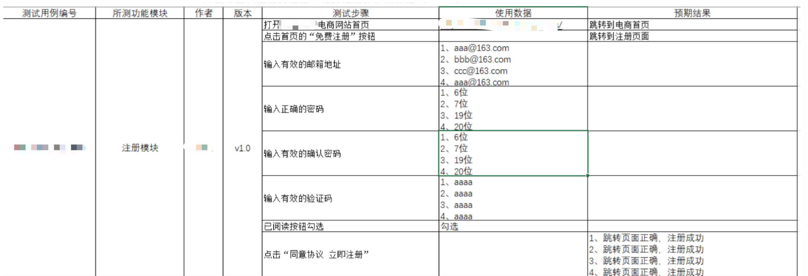

## 页面滚动条操作

```
使用JS实现
• 左右移动：js="window.scrollTo(200,1000)"
上面的参数说明,第一个参数越大越往右边,第二个参数越大越往底部
• Js代码的执行需要用到的方法：driver.execute_script(js)

#!/usr/bin/env python
# -*- coding:utf-8 -*-  
#====#====#====#====   
#Author:
#CreatDate:
#Version: 
#====#====#====#====

from selenium import webdriver
import time

def mytest():
    dr=webdriver.Firefox()
    dr.get("https://www.baidu.com")
    time.sleep(2)
    dr.set_window_size(400,300)
    time.sleep(3)
    js="window.scrollTo(1000,1000)"
    #执行js代码
    dr.execute_script(js)
    time.sleep(5)
    dr.quit()

# mytest()

#让qq首页慢慢丝滑的往下滑动
def mytest02():
    dr=webdriver.Firefox()
    dr.get("https://www.qq.com")
    time.sleep(2)
    for i in range(100):
        js="window.scrollTo(0,%d)"%(i*50)
        dr.execute_script(js)
        time.sleep(0.2)

    dr.quit()

mytest02()

```

## 元素等待

```
如今很多web都在使用AJAX技术，运用这种技术的软件当浏览器加载页面时，页面上的元素可能不会被同步加载完成，如此一来，定位元素时就会出现困难。我们可以通过设置元素等待来改善这类问题导致的测试脚本不稳定
WebDriver提供了三种种元素等待方式：


1、强制等待：

   time.sleep(5),单位是s，休眠，就是直接让线程休眠，这几秒啥事也不用干

2、隐式等待：

   在脚本创建driver对象之后，给driver设置一个全局的等待时间，对driver的整个生命周期（创建到关闭）都起效。如果在设置等待时间（超时时间）内，定位到了页面元素，则不再等待，继续执行下面的代码如果超出了等待时间，则抛出异常
	driver.implicity_wait(10)
	注意：在使用隐式等待的时候，实际上浏览器会在你自己设定的时间内部不断的刷新页面去寻找我们需要
			
3、显式等待：

   显示等待，就是明确的要等到某个元素的出现或者是某个元素的可点击等条件，等不到，就一直等，除非在规定的时间之内都没找到，那么就抛出Exception。(简而言之，就是直到元素出现才去操作，如果超时则报异常)

需要特别关注某一个元素的加载问题，才需要使用涉及到的方法：

#构造一个WebDriverWait的一个对象

WebDriverWait(driver, timeout, poll_frequency=0.5, ignored_exceptions=None)
参数说明:
driver：浏览器驱动
timeout：最长超时时间，默认以秒为单位
poll_frequency：检测的间隔步长，默认为0.5s
ignored_exceptions：超时后的抛出的异常信息，默认抛出NoSuchElementExeception异常。

util(method,info):直到满足某一个条件，返回结果，等不到就抛错


method->expected_conditions.presence_of_element_located(locator):判断某个元素是否定位到了
	locator-->（By.Id，"kw"）\(By.Name,"wd")
需求：使用显示等待的方式去等百度首页的百度一下按钮显示出来，如果出来就点击，否则print()


  注意：若同时设置了隐式等待和显示等待，则以隐式等待为第一优先级，也就是说，若隐式等待时间大于显示等待，显示等待时间设置无效，因为driver若找不到元素，会先等待隐式等待的时间,对time.sleep()没有影响，只要执行到这句代码，就会等待

```


## 自动化测试用例设计

```
一、自动化测试用例设计（熟练掌握）
1、自动化测试用例一般可以由手工测试用例转化而来，需注意

    不是所有的手工测试用例都要转为自动化测试用例
    考虑到脚本开发的成本，不要选择流程太复杂的用例，可以把流程拆分成多个用例
    选择的用例最好可以构建成场景
    选取的用例可以是你认为是重复执行、很耗时间的部分，例如字段验证
    选取的用例可以是主流程用例，即适用于冒烟测试的用例

2、自动化测试用例的设计原则（熟练掌握）

    一个用例为一个完整的场景，从用户登录系统到最终退出并关闭浏览器
    一个用例只验证一个功能点，不要试图在用户登录后把所有的功能都验证一遍
    尽可能少的编写逆向测试用例，一方面因为逆向逻辑的用例很多
    另一方面自动化测试脚本本身比较脆弱
    用例和用例之间尽量避免产生依赖。
    一条用例完成测试之后需要对测试场景进行还原，以免影响其它用例的执行

3、自动化测试用例设计实践（熟练掌握）
测试点转为测试用例的原则是什么？

    设计一条正向用例，覆盖足够多的有效等价类数据
    设计一条反向用例，需要覆盖一条无效等价类数据，其他数据一概使用正向数据

有验证码的时候，该怎么进行自动化？

    让开发暂时屏蔽验证码、将验证码改为万能码（‘aaaa’）
    懂机器学习，可以训练样本，可以达到99%以上识别成功率
    调用OCR的接口，去解析图片中验证码，然后来用


```

测试用例设计参考模版的demo



## 线性脚本开发

```

线性测试：以一行行的代码直接实现测试步骤，脚本相对独立，单纯的模拟用户完整的操作场景，测试用例的开发和维护成本很高，如果一个页面元素被改动了，所有线性脚本中用到这个元素的都需要更改。是最基本的


```


## 模块化驱动脚本开发

```
模块化驱动测试：把常用、公用的一些功能、业务、步骤专门提取出来，写在一个专门的模块中，以方法、类的形式实现出来，再其他的模块如果需要这些功能，直接调用即可，无需重复显示这些代码。比如可以做登录模块、退出模块、邮件发送模块、数据库处理模块、日志生成模块等
模块化驱动测试最大层度地去除了重复，提高了测试脚本的复用性和可维护性。

场景:
用户注册模块的测试,用户登录模块的测试,登录后对一个加法函数进行测试


业务代码:
#!/usr/bin/env python
# -*- coding:utf-8 -*-  
#====#====#====#====   
#Author:
#CreatDate:
#Version: 
#====#====#====#====
import MyTools,mytest
tools=MyTools.Maker()

#写业务代码
print("请用选择你要执行的业务:1是注册  2是登录")
n=input(":")
if n=="1" or n=="2":
    if n=="1":
        name,passwd,iph=tools.getUserReg()
        #查询是否有这个用户
        data = tools.myselect(name)
        if data!=():
            #先删除用户存储到表中的旧信息
            tools.mydelteMysql(name)
        #加密密码
        respasswd=tools.myMD5(passwd)
        #存储新的信息
        tools.mysaveMysql((name,respasswd,iph))
        print("注册成功")
    elif n=="2":
        #获取用户的登录信息
        name,passwd=tools.getUserLogin()
        #加密后的密码
        respasswd=tools.myMD5(passwd)
        #获取数据库中的密码
        data=tools.myselect(name)
        #进行对比
        islogin=tools.isContranst(data[0][1],respasswd)
        if islogin:
            print("登录成功")
            #测试一个加法方法
            res=mytest.add(10,20)
            if res==30:
                print("加法函数正确")
            else:
                print("加法函数不正确")
        else:
            print("登录失败")

else:
    print("请输入正确的选项")


功能代码:
#!/usr/bin/env python
# -*- coding:utf-8 -*-  
#====#====#====#====   
#Author:
#CreatDate:
#Version: 
#====#====#====#====
import pymysql
import hashlib

class Maker():
    # 加密方法
    def myMD5(self,mystr):
        md5str = hashlib.md5(mystr.encode(encoding='utf=8')).hexdigest()
        return md5str

    # 通过name来查询数据库中的数据
    def myselect(self,name):
        db = pymysql.connect(host="127.0.0.1", port=3306, user="root", passwd="123456", db="mytest202305")
        cur = db.cursor()
        sql = "select *from user where name='%s'" % name
        cur.execute(sql)
        data = cur.fetchall()
        # print(data[0][1])
        return data

    # 存储信息到数据库
    def mysaveMysql(self,msg):
        db = pymysql.connect(host="127.0.0.1", port=3306, user="root", passwd="123456", db="mytest202305")
        cur = db.cursor()
        sql = "insert into user values('%s','%s','%s')" % (msg[0], msg[1], msg[2])
        cur.execute(sql)
        db.commit()
        db.close()

    #删除数据库中的数据
    def mydelteMysql(self,name):
        db = pymysql.connect(host="127.0.0.1", port=3306, user="root", passwd="123456", db="mytest202305")
        cur = db.cursor()
        sql = "delete from user where name='%s'"%name
        cur.execute(sql)
        db.commit()
        db.close()

    # 获取用户信息方法
    def getUserReg(self):
        while True:
            print("用户名的长度必须是6-18个字符,字母,数字,下划线等其他字符组成,字母开头")
            name = input("请输入用户名:")
            if len(name) >= 6 and len(name) <= 18:
                pass
            else:
                print("你输入的字符个数不够或超出了字符个数限制")
                continue

            if (ord(name[0]) >= 65 and ord(name[0]) <= 90) or (ord(name[0]) >= 97 and ord(name[0]) <= 122):
                pass
            else:
                print("你输入的首字符不是字母")
                continue

            print("密码长度必须是6-18个字符,字母,数字,下划线等其他字符组成")
            passwd = input("请输入密码:")
            if len(passwd) >= 6 and len(passwd) <= 18:
                pass
            else:
                print("你输入的字符个数不够或超出了字符个数限制")
                continue

            print("只能是中国内陆的手机号码")
            iph = input("请输入你的手机号码:")
            # 首先要11位,要是纯数字,首字符必须是1
            if len(iph) == 11 and iph.isdigit() and iph[0] == "1":
                pass
            else:
                print("输入的手机号码不符合规定")
                continue

            print("输入的信息都符合")
            break

        return name, passwd, iph

    def getUserLogin(self):
        # 从终端获取用户的信息
        name = input("请输入用户名:")
        if len(name) >= 6 and len(name) <= 18:
            pass
        else:
            print("你输入的字符个数不够或超出了字符个数限制")

        if (ord(name[0]) >= 65 and ord(name[0]) <= 90) or (ord(name[0]) >= 97 and ord(name[0]) <= 122):
            pass
        else:
            print("你输入的首字符不是字母")

        passwd = input("请输入密码:")
        if len(passwd) >= 6 and len(passwd) <= 18:
            pass
        else:
            print("你输入的字符个数不够或超出了字符个数限制")
        return name, passwd

    #对比模块
    def isContranst(self,msg1,msg2):
        if msg1==msg2:
            return True
        else:
            return False
            
            
被测试的方法代码:
#!/usr/bin/env python
# -*- coding:utf-8 -*-  
#====#====#====#====   
#Author:
#CreatDate:
#Version: 
#====#====#====#====

def add(a,b):
    return a+b


场景:打开百度首页,获取百度热搜中第一个新闻标题,然后把新闻标题复制到点开新闻链接页面的搜索框中,然后点击百度一下,获取相关资讯数量,然后把这个数量填写到QQ邮箱登录页面的QQ号码输入框中
功能代码:
#!/usr/bin/env python
# -*- coding:utf-8 -*-  
#====#====#====#====   
#Author:
#CreatDate:
#Version: 
#====#====#====#====
from selenium import webdriver
import time
from selenium.webdriver.common.by import By
class Maker():
    #打开浏览器并进入到指定网站
    def openHtml(self,url):
        dr=webdriver.Firefox()

        dr.get(url)
        time.sleep(2)
        return dr
    #获取元素
    def getELE(self,dr,type,msg):
        if type=="By.ID":
            e=dr.find_element(By.ID,msg)
        elif type=='By.LINK_TEXT':
            e = dr.find_element(By.LINK_TEXT, msg)
        elif type=='By.PARTIAL_LINK_TEXT':
            e = dr.find_element(By.PARTIAL_LINK_TEXT, msg)
        return e


    #操作元素
    def operateELE(self,e,type,msg=""):
        if type=="text":
            e.text
        elif type=="click":
            e.click()
        elif type=="send_keys":
            e.send_keys(msg)

业务代码
#!/usr/bin/env python
# -*- coding:utf-8 -*-  
#====#====#====#====   
#Author:
#CreatDate:
#Version: 
#====#====#====#====
import MyseleniumTools
# 场景:打开百度首页,获取百度热搜中第一个新闻标题,然后把新闻标题复制到点开新闻链接页面的搜索框中,\
# 然后点击百度一下,获取相关资讯数量,然后把这个数量填写到QQ邮箱登录页面的QQ号码输入框中

'''
1.打开浏览器进入指定网站模块
2.获取元素模块
3.操作元素模块
'''
tools=MyseleniumTools.Maker()
dr=tools.openHtml("https://www.baidu.com")
'''
By.ID
By.NAME
By.LINK_TEXT
By.PARTIAL_LINK_TEXT
By.TAG_NAME
By.CLASS_NAME
By.CSS_SELECTOR
By.XPATH
'''
e=tools.getELE(dr,'By.PARTIAL_LINK_TEXT',"共谋发展 共享未来")
#代码未完成
```

