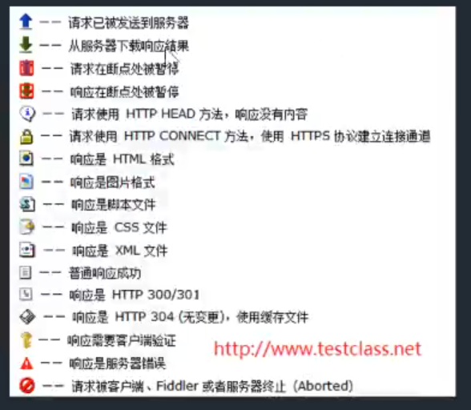

## 抓包介绍

```
1.什么是抓包
抓包（packet capture）就是将网络传输发送与接收的数据包进行截获、重发、编辑、转存等操作，也用来检查网络安全。抓包也经常被用来进行数据截取等
```


## 抓包的原理和主流工具

```
1.抓包的原理
代理就是在客户端和服务器之间设置一道关卡，客户端先将请求数据发送出去后，代理服务器会将数据包进行拦截，代理服务器再冒充客户端发送数据到服务器；同理，服务器将响应数据返回，代理服务器也会将数据拦截，再返回给客户端。

2.主流工具
名称			支持平台			优缺点
wireshark	linux、windows	linux平台支持好,功能强大	不能解析https的内容
fidder		windows功能		功能强大，支持修改报文	仅支持windows
Charles		window、Mac		 可以按照域名进行分层级查看	需要收费
Burp Suite	支持java的平台	  黑客喜欢用的功能强大工具	界面不是很好看
```

## Fiddler基本功能简介

```
1.Fiddler是什么?
Fiddler是强大的抓包工具，它的原理是以web代理服务器的形式进行工作的
2.有什么功能?
它能记录所有客户端和服务器的http和https请求
允许你监视
设置断点
甚至修改输入、输出数据


```

## 火狐浏览器设置

```
要抓火狐浏览器发送的包需要进行设置:
1.打开Fiddler,选择工具->选项->connections->点击(Copy Browsr Proxy Configuration URL)
2.打开火狐浏览器,点击右上角三横->选项->常规->网络设置->设置...->自动代理配置的 URL（PAC）->把刚才复制的url粘贴上去
3.重启浏览器和Fiddler
```


## Fiddler抓包设置

```
一.HTTP代理请求
1、 启动代理 ：点击窗口左下角，显示 “Capuring” 侧说明当前处于代理状态。(在抓包)
2、通过浏览器访问相关网页或执行页面操作（如，登录、搜索）。
3、通过Fiddler查看代理的HTTP请求进行分析


二.分析请求数据
1.请求统计
2.会话详细(上半部分是请求,下半部分是回应)

三.设置HTTP和HTTPS请求
HTTPS要证书,Fiddler有这证书
看讲义
1.打开菜单栏：Tools –> Fiddler Options 打开fiddler配置。
2.打开 HTTPS 配置项，勾选“Capture HTTPS CONNECTs”和“Decrypt HTTPS traffic”，然后点击“OK”。

ctr+x,清空包
```



## Fiddler主机过滤

```
1.设置Action(如果不保存,重启后要再次设置,如果保存了,再次开启时,可也加载设置文件)
Run Filterset now 是否立即运行
Load Filterset  加载
Save Filterset  保存；

2.保存设置和加载设置
	1.点击保存,存储设置文件
	2.重启,Fiddler时,点击加载,选择设置文件

3.主机过滤
Zone：指定只显示内网（Intranet）或互联网（Internet）的内容
目标主机:
-No Host Filter：无HOST过滤；(不过滤,所有的都用)
-Hide the following Hosts：隐藏下面的条件;
-Show only the following Hosts:只显示下面过滤条件;
-Flag the following Hosts：下面输入进行标记
输入框中输入
注意：输入多个HOST，多个之前用半角逗号或者回车分隔；
支持通配符：*.baidu.com；

操作演示:(常用操作)
1.选择互联网(Internet)
2.选择只显示下面过滤条件(Show only the following Hosts)
3.输入框中输入:*.baidu.com
4.Save Filterset  保存；
5.Action中的Run Filterset now 是否立即运行
6.打开浏览器,进入百度和腾讯
7.操作腾讯,发现没有左侧没有增加包,然后操作百度,发现增加了包


4.客户端过滤:
Show only traffic from：可以指定只捕获哪个Windows进程中的请求；可以看左侧程序的编号
Show only Internet Explorer traffic：只显示IE发出的请求；(chrome的请求会被过滤)
Hide trafficfrom Service Host:隐藏来自service host（即由svchost.exe进程发出）的请求
svchost.exe是一个属于微软Windows操作系统的系统程序(了解)

操作演示:
1.打开谷歌浏览器,Fiddler,
2.勾选Show only traffic from,左侧看进程名和端口号,然后右侧选择
3.打开火狐浏览器,进入随便一个页面,发现Fiddler里没有抓火狐的包
3.取消勾选Show only traffic from,在刷新火狐页面,发现有火狐的包


```


## Fiddler请求过滤

```
请求首页过滤配置:

Show only if URL contains：只显示URL中包含的字符串（字符串可以是URL中的一部分，多部分用空格分开，可以正则或完整的URL），例如REGEX:\.(js|css|js\?.*|css\?.*)$（隐藏所有js和css请求）；

Hide if URL contains：与Show only if URL contains相反，一个是显示，一个是隐藏；
演示:
1.勾选Show only if URL contains
2.看左侧的url,随便选择一个填上
3.点击右上面的Actions
4.发现左侧少了很多包


Flags requests with headers：支持指定某个http请求头名称，如果在web session列表中存在该请求头，会加粗显示该session； 如:Host


Delete requests headers：与Flags requests with headers类似，这里是如果包含该请求头，则删除该请求头；
演示:
1.输入Host
2.右上面的Actions,选择
3.发现左边有加粗的包,点击一个
4.选择会话详情,上部分拉到低,头部信息有Host


Set request header：将HTTP请求头更新为所输入的值。
演示:
1.勾选Set request header
2.输入Host host
3.刷新页面,发现很多错误
4.因为我们改变了HTTP请求头

```

## Fiddler断点

```
断点:程序运行或发送过程进行暂停,我们可以暂停发送,然后修改
可以在谷歌浏览器中的F12,Network->Name(选择下面的请求)->Headers可以看到详细信息
Break request on HTTP POST：给所有POST请求设置断点；
演示:
1.选择Flters
2.Hosts中选择Show only the following Hosts
3.输入*qq.com
4.勾选Break request on HTTP POST
5.点击Action,选择Run Filterset now 是否立即运行
6.进入qq邮箱注册,填入注册信息,点击发送短信验证码
7.看左侧的包
8.要继续,点击菜单工具下面的继续


Break request on HTTP GET with QueryString：给所有带参数的GET请求设置断点；
学员演示

Break response on Content-Type：给特定的Content-Type(内容的类型)设定断点
演示:
1.选择Flters
2.Hosts中选择Show only the following Hosts
3.输入*qq.com
4.勾选Break response on Content-Type,填入:text/json
5.点击Action,选择Run Filterset now 是否立即运行
6.刷新qq首页
7.查看左侧的包
8.要继续,点击菜单工具下面的继续

Break on XMLHttpRequest:给xml请求设置断点

演示断点改发送数据:
1.在Filters中设置,
2.Show only the following Hosts:只显示下面过滤条件;
3.勾选Break request on HTTP GET with QueryString
4.点击Action,选择Run Filterset now 是否立即运行
5.最上面菜单-规则->自动断电->在请求前
6.打开浏览器,进入百度首页,放行所有的断点
7.在百度首页输入python,回车
8.放行,看包中url有s?wd的包
9.速度要快,改,双击击这个包
10.选择网格视图,找到name叫wd的,马上修改
11.然后放行断点,回到浏览器上,看到搜索框的文字变了


```

## Code的过滤

```
Hide success(2xx) 隐藏状态码在200至299的响应
Hide non-2xx 隐藏非200至299的响应
Hide Authentication demands(401,407) 隐藏状态码为401，407的响应。需要用户进一步确认证书的请求
Hide redirects(300,301,302,303,307) 隐藏状态码为300,301,302,303,307重定向的响应
Hide Not Modified(304) 隐藏状态码为304的响应。缓存实体有效返回304

演示:
1.打开Fiddler,启动抓包
2.打开浏览器,输入www.qq.com
3.可以看到左侧有很多包
4.勾选Hide success(2xx)
5.选择Action,点击Run Filterset now 是否立即运行
6.可以看到左侧的状态码200的,隐藏了

```

## 响应类型和大小过滤

```
Show all Content-Types 不过滤
Show only IMAGE/* 只显示Content-Type是图像类型的Session
Show only HTML 只显示Content-Type是HTML类型的Session
Show only TEXT/CSS 只显示Content-Type是text/css类型的Session
Show only SCRIPTS 只显示Content-Type是脚本类型的Session
Show only XML 只显示Content-Type是xml类型的Session
Show only JSON 只显示Content-Type是json类型的Session
Hide IMAGE/* 隐藏Content-Type是图片类型的Session
演示:
1.打开qq首页,抓包
2.选择Show only JSON
3.选择Action,点击Run Filterset now 是否立即运行
4.可以看到左侧少了很多包,留下的包的数据传输格式都的json
5.选择一个包,双击,在会话详细的下部分的协议头可以看到Content-Type: text/json

Time HeatMap 基于服务器返回响应时间给每个Session设置背景色。小于50ms绿色，50-300ms不着色，300-500ms黄色，大于500ms红色
演示:
1.选择Show all Content-Types:不过滤
2.勾选Time HeatMap
3.刷新QQ首页,可以看到有些包的背景颜色有变化

Hide smaller than 隐藏响应体小于指定字节数的响应
Hide larger than 隐藏响应体大于指定字节数的响应
Block script files 返回响应头Content-Type为脚本，将返回HTTP/404响应
Block image files 返回响应头Content-Type为图像，将返 回HTTP/404响应
Block SWF files 返回响应头Content-Type为flash，将返回HTTP/404响应
Block CSS files 返回响应头Content-Type为css，将返回HTTP/404响应
演示:
1.勾选上Block image files
2.刷新qq首页
3.可以看到左侧很多包变为红色,404


```

## 响应头过滤

```
Flag responses that set cookies 粗体显示响应头包含Set-Cookie的响应
演示:
1.开启抓包,勾选Flag responses that set cookie
2.登录qq邮箱,勾选下次自动登录
3.可以看到有的包加粗了

Flag responses with headers 粗体显示指定HTTP响应头。同Flag requests with headers
Delete responses headers 删除特定的HTTP响应头。只是从响应头中删除，不删除Session
Set response header 创建更新响应头。同Set request header用法一样

```


## Fiddler的HTTP统计视图

```
通过陈列出所有的HTTP通信量，Fiddler可以很容易的向您展示哪些文件生成了您当前请求的页面。使用Statistics(请求统计)页签最下面的(show chart)，用户可以通过选择多个会话来得来这几个会话的总的信息统计，比如多个请求和传输的字节数
```

## QuickExec命令行的使用

```
常见得命令有
help 打开官方的使用页面介绍，所有的命令都会列出来
cls 清屏 (Ctrl+x 也可以清屏)
@baidu.com --选择会话中域名包含 host 的会话(host的值中保护baidu.com)，此时按Enter键可高亮所有匹配的结果(协议头查看host的值)
?.png 用来选择png后缀的图片
?baidu ---URL中的字符，可为函数名，录入并执行enter后会高亮显示在会话窗口
>4000 ---选择Response Body(返回的数据) 值大于 4000 字节的 Sessions
=301/post/get --状态码/请求方式

```

## 命令行设置断点

```
只中断特点的会话
bpu www.baidu.com (这种方法只会中断www.baidu.com)

```


## 设置IP地址显示

```
在测试过程中，我们经常需要通过host在不同的环境之间切换，如何知道自己的环境是否切换成功，那么通过IP地址就很容易判断。
打开Fiddler, 菜单栏：Rules(规则)->Customize Rules…(自定义规则...) 

通过快捷键 Ctrl+F ,搜索：static function Main() 函数。 在函数中添加一行代码，如下
 FiddlerObject.UI.lvSessions.AddBoundColumn("ServerIP",120,"X-HostIP")

左侧最后面出现ServerIP列
```


## 会话比较功能

```
选中2个会话，右键然后点击Compare，就可以用WinDiff来比较两个会话的不同了 (当然需要你安装WinDiff)

把winDiff.exe的路径加入到path中,重启Fiddler,就可以
```

